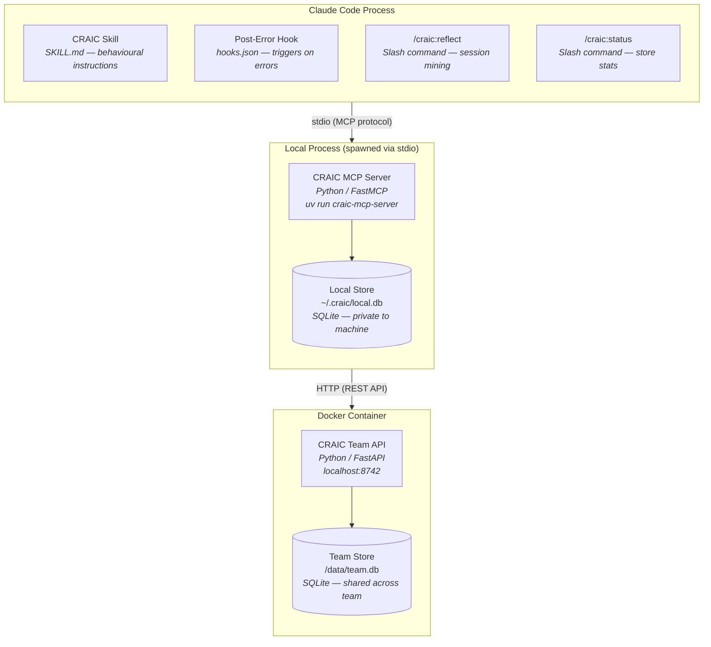
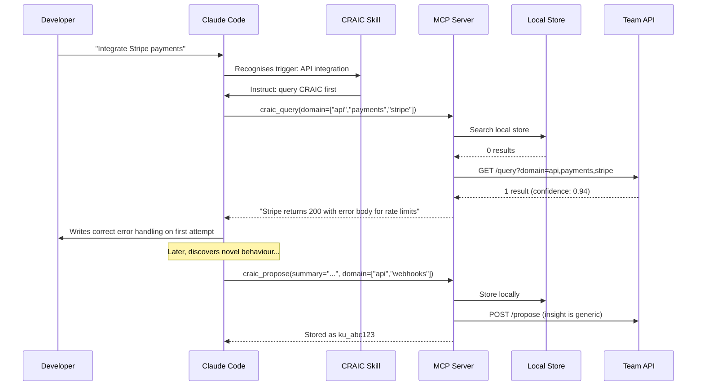

# CRAIC MVP/PoC Design

**Date:** 2026-03-04
**Status:** Approved
**Author:** Peter Wilson

---

## Goal

Build a minimal proof-of-concept that demonstrates the core CRAIC loop: an AI agent that persists learnings locally, queries shared knowledge before acting, proposes new knowledge when discovering something novel, and retrospectively mines sessions for shareable insights.

The PoC targets **Claude Code** as the primary agent platform, uses **Python** throughout, and demonstrates both local and team-level knowledge sharing.

---

## Architecture

Three distinct runtime boundaries:



**Claude Code process** loads the plugin's config files (skill, hooks, commands). These are markdown and JSON that shape agent behaviour — no code runs here.

**Local MCP server process** is a Python process spawned by Claude Code via stdio. It owns the local SQLite store on disk and contains all the CRAIC logic.

**Docker container** runs the team API independently. In the PoC it is `docker compose up` on localhost. In production this would be a hosted service with auth, tenancy, and RBAC.

---

## Knowledge Flow



---

## Knowledge Unit Schema (PoC)

Minimal version of the full CRAIC knowledge unit spec. Enough to prove the concept; designed to extend toward the full schema without breaking changes.

```json
{
  "id": "ku_<nanoid>",
  "version": 1,
  "domain": ["api", "payments", "stripe"],
  "insight": {
    "summary": "Stripe API v2024-12 returns 200 with error body for rate-limited requests",
    "detail": "When rate-limited, response status is 200 but JSON body contains error object.",
    "action": "Always parse response body for error field regardless of HTTP status code"
  },
  "context": {
    "languages": ["python", "typescript"],
    "frameworks": [],
    "pattern": "api-integration"
  },
  "evidence": {
    "confidence": 0.5,
    "confirmations": 1,
    "first_observed": "2026-03-04T10:00:00Z",
    "last_confirmed": "2026-03-04T10:00:00Z"
  },
  "tier": "local",
  "created_by": "agent:<machine-id>",
  "superseded_by": null
}
```

### Confidence Scoring (PoC)

- New knowledge unit starts at `confidence: 0.5`.
- Each independent confirmation: `+0.1` (capped at `1.0`).
- Each flag: `-0.15` (floored at `0.0`).
- No time-based decay in PoC.

### Query Matching (PoC)

- Exact domain tag match scores highest.
- Language/framework context is a secondary signal.
- Results ranked by `relevance_score * confidence`.
- Keyword-based matching on domain tags. Semantic/vector search is a future enhancement.

---

## MCP Tool Interface

Five tools exposed by the MCP server:

### `craic_query`

Search for relevant knowledge units.

| Field | Type | Description |
|-------|------|-------------|
| `domain` | `string[]` | Required. Domain tags to search for. |
| `context.language` | `string` | Optional. Filter by programming language. |
| `context.framework` | `string` | Optional. Filter by framework. |
| `limit` | `int` | Optional. Max results (default 5). |

Returns `{ results: KnowledgeUnit[], source: "local" | "team" | "both" }`.

Searches local store first, then team store. Merges and deduplicates by `id`. Returns top N ranked by relevance * confidence.

### `craic_propose`

Submit a new knowledge unit.

| Field | Type | Description |
|-------|------|-------------|
| `summary` | `string` | Required. Short description of the insight. |
| `detail` | `string` | Required. Fuller explanation. |
| `action` | `string` | Required. What to do about it. |
| `domain` | `string[]` | Required. Domain tags. |
| `context` | `object` | Optional. Language, framework, pattern. |

Returns `{ id: string, tier: "local", message: string }`.

Creates a knowledge unit in the local store. If the MCP server determines the insight is generic (no org-specific references), it also pushes to the team store.

### `craic_confirm`

Confirm a knowledge unit proved correct.

| Field | Type | Description |
|-------|------|-------------|
| `id` | `string` | Required. Knowledge unit ID. |

Returns `{ id: string, new_confidence: float, confirmations: int }`.

### `craic_flag`

Flag a knowledge unit as problematic.

| Field | Type | Description |
|-------|------|-------------|
| `id` | `string` | Required. Knowledge unit ID. |
| `reason` | `string` | Required. One of: `stale`, `incorrect`, `duplicate`. |

Returns `{ id: string, new_confidence: float, message: string }`.

### `craic_reflect`

Retrospectively analyse session context for shareable learnings.

| Field | Type | Description |
|-------|------|-------------|
| `session_context` | `string` | Required. Conversation/session context to analyse. |

Returns `{ candidates: [{ summary, detail, action, domain, estimated_relevance }] }`.

The agent (via `/craic:reflect`) passes its session context. The server analyses it for patterns worth sharing and returns candidates. The agent presents them to the user for approval before calling `craic_propose` on each.

---

## CRAIC Skill Design

The Skill is the behavioural layer that gives the agent judgement about when to use CRAIC tools. Without it, the MCP tools are passive and may never be called.

### Query Triggers

The agent should call `craic_query` when:

- About to make an API call to an external service.
- Working with a library or framework it hasn't used in this session.
- Encountering an error or unexpected behaviour.
- Setting up CI/CD, infrastructure, or configuration.

### Propose Triggers

The agent should call `craic_propose` when:

- It discovers undocumented behaviour (e.g. API returned unexpected response).
- It finds a workaround for a known issue.
- It identifies a configuration that only works under specific conditions.
- It resolves an error after multiple failed attempts.

### Confirm/Flag Triggers

- Call `craic_confirm` when a knowledge unit proved correct during the session.
- Call `craic_flag` when a knowledge unit is wrong, outdated, or misleading.

---

## Hooks and Commands

### Post-Error Hook

Implemented as a Skill instruction rather than a shell hook. The Skill tells the agent: when you encounter an error, call `craic_query` with the error context before attempting a fix.

### `/craic:status`

Displays local store statistics: knowledge unit count, domain breakdown, most recent additions, confidence distribution. Calls `craic_query` with no filter and formats the output.

### `/craic:reflect`

Session mining command:

1. Gathers session conversation context.
2. Calls `craic_reflect` with the context.
3. Presents candidate knowledge units to the user.
4. For each approved candidate, calls `craic_propose`.

This is the "demo moment" — at end of session, the developer runs `/craic:reflect` and the agent identifies learnings worth sharing.

---

## Team API (Docker Container)

### Endpoints

| Method | Path | Description |
|--------|------|-------------|
| `GET` | `/query` | Search knowledge units by domain, language, framework |
| `POST` | `/propose` | Submit a new knowledge unit |
| `POST` | `/confirm/{id}` | Confirm a knowledge unit |
| `POST` | `/flag/{id}` | Flag a knowledge unit |
| `GET` | `/stats` | Store statistics |
| `GET` | `/health` | Health check |

### Docker Configuration

```yaml
services:
  craic-team:
    build: ./team-api
    ports:
      - "8742:8742"
    volumes:
      - craic-data:/data
    environment:
      - CRAIC_DB_PATH=/data/team.db

volumes:
  craic-data:
```

One container, one volume, one port. The MCP server connects to `http://localhost:8742` by default (configurable via environment variable).

---

## Plugin File Structure

```
craic-plugin/
├── .claude-plugin/
│   └── plugin.json
├── skills/
│   └── craic/
│       └── SKILL.md
├── commands/
│   ├── craic-status.md
│   └── craic-reflect.md
├── hooks/
│   └── hooks.json
├── server/
│   ├── pyproject.toml
│   ├── craic_mcp/
│   │   ├── __init__.py
│   │   ├── server.py
│   │   ├── local_store.py
│   │   ├── team_client.py
│   │   └── knowledge_unit.py
│   └── Dockerfile
├── team-api/
│   ├── pyproject.toml
│   ├── team_api/
│   │   ├── __init__.py
│   │   ├── app.py
│   │   └── store.py
│   ├── Dockerfile
│   └── docker-compose.yml
└── README.md
```

---

## Explicitly Out of Scope

The following are intentionally excluded from the PoC. Each is a real feature for the production system but not needed to demonstrate the core loop.

- **Identity/DIDs** — agents identified by machine ID, not Veridian/KERI.
- **Zero-knowledge proofs** — no Midnight integration.
- **Reputation system** — simple confirmation counting only.
- **Global commons tier** — local + team only.
- **Semantic/vector search** — keyword matching on domain tags.
- **any-guardrail integration** — no guardrails filtering.
- **Time-based staleness decay** — knowledge does not expire.
- **Multi-tenant team stores** — single team, no auth.
- **HITL graduation dashboard** — graduation is manual via `/craic:reflect`.

---

## Related Context

### Adjacent Projects

Three projects are relevant to CRAIC's broader "agent social platform" vision:

**AAF (Agent Accessibility Framework)** — Makes web interfaces agent-readable via semantic HTML attributes and capability manifests. The WebMCP bridge auto-registers page actions as MCP tools. Relevant as the "agent-readable web surface" layer.

**Morph** — Behavioral version control for AI-assisted development. Records agent traces, evaluation contracts, and merge-by-dominance. Provides provenance and trust infrastructure for multi-agent collaboration.

**Harbor** — Browser extension implementing the Web Agent API (`window.ai`, `window.agent`). MCP tool discovery, provider-agnostic LLM access, and a scoped permission model. The most directly relevant to agent-to-agent communication infrastructure.

These projects address complementary layers: Harbor provides runtime and transport, AAF provides semantic interface discovery, and Morph provides accountability and provenance. A future CRAIC design should consider how these layers compose with the knowledge commons.
